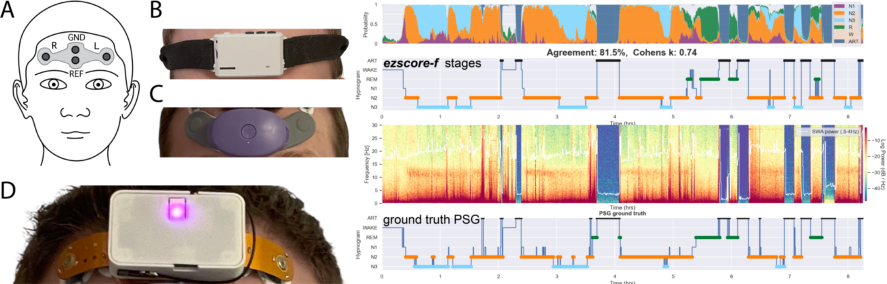
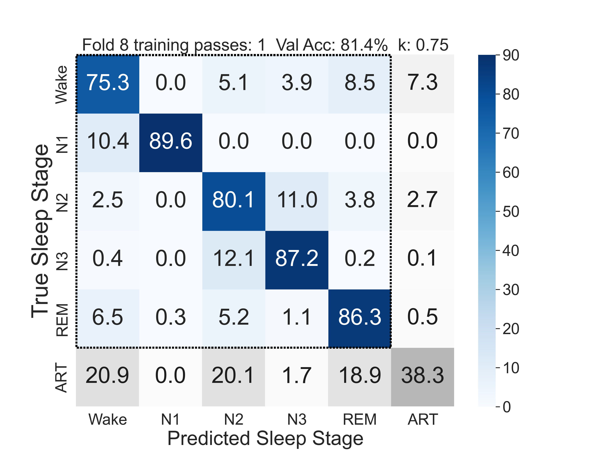
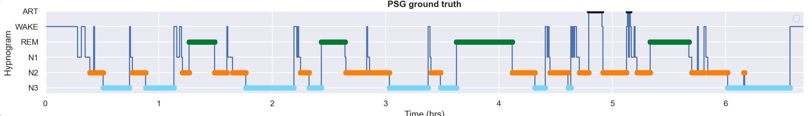

# ezscore-f
<p align="center">
  
</p>
### Pretrained artifact-aware sleep stage classifiers for forehead EEG. ###

<p align="center">  
  
  <figcaption><strong>ezscore-f is for 2-channel forehead EEG, and is <em>artifact-aware</em>.</strong>  ezscore-f automatically detects and isolates signal artifact commonly encountered in forehead EEG devices.  Figure from <em>Coon et al. 2025</em>: ezscore models were trained on ZMax data and validated on ZMax (B) and DCM (D) data. CGX (C) validation is in-progress (coming soon!). *Note that CGX is NOT yet officially supported*.
  </figcaption>
</p>

### Pretrained artifact-aware sleep stage classifiers for forehead EEG. ###

- 📦 Ready-to-use model checkpoints 
- 📈 Supports real-time and offline scoring  
- 🧪 Artifact-aware: isolates artifact for robust, accurate sleep staging


### Copyright (C) 2025 The Johns Hopkins University Applied Physics Laboratory LLC
---

# 📢 What's New (June 2025)

**ezscore-f just got even better.**  
We've updated the model training pipeline to include **custom loss functions targeting class imbalance**, improving performance in minority classes such as **N1 sleep**.

The image below shows the updated model's confusion matrix on the same test set used in our original evaluation (Coon et al., 2025):

<p align="center">
  
</p>

> **Figure**: Confusion matrix of the updated ezscore-f model, `ez6`.  `ez6` is the best-performing version of the model to-date.
> Notably improved classification of N1 sleep and better artifact separation, following the integration of custom loss functions during training.

---

# Install

### Install Python environment / package manager 
We use the `uv` package manager (you can skip this step if you already use `uv`).  You can find full install documentation here: https://docs.astral.sh/uv/getting-started/installation/

For macOS and linux, you can use `curl` to download the script and execute it with sh:

    `curl -LsSf https://astral.sh/uv/install.sh | sh`

If your system doesn't have `curl`, you can use `wget`:

    `wget -qO- https://astral.sh/uv/install.sh | sh`

### Install ezscore
Once you have `uv` installed, you can install `ezscore-f` from Terminal after navigating to the directory of your choice:

```bash
git clone https://github.com/coonwg1/ezscore.git
cd ezscore

uv venv
uv pip install -e .
source .venv/bin/activate
```

### Test Installation
You can test the installation by running the demo script from a Terminal window like this:
```bash
python ezscore_demo.py
```

If everything installed correctly, the script should open a new figure window with a plot that looks like this:

<p align="center">
  
</p>

> **Figure**: Demo script output using included sample data (ZMax EDFs) and the latest `ez6` model (corresponds to the confusion matrix above)...

And below are the "ground truth" sleep stages derived from concurrently recorded PSG and consensus scoring by multiple trained experts. 

<p align="center">
  
</p>

> **Figure**: PSG ground truth for demo example.
---

If you use ezscore models (`ez6`, `ez6rt`, etc.), please cite our paper: https://www.biorxiv.org/content/10.1101/2025.06.02.657451v1
- Coon WG, Zerr P, Milsap G, Sikder N, Smith M, Dresler M, Reid M. "*ezscore-f: A Set of Freely Available, Validated Sleep Stage Classifiers for Forehead EEG.*" bioRxiv, 2025, doi: 10.1101/2025.06.02.657451. 

