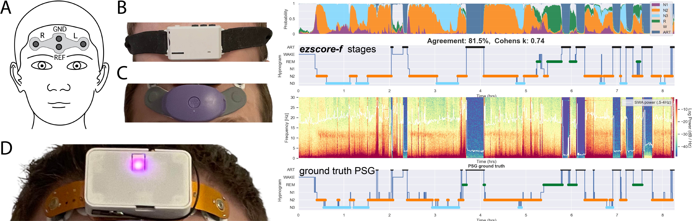
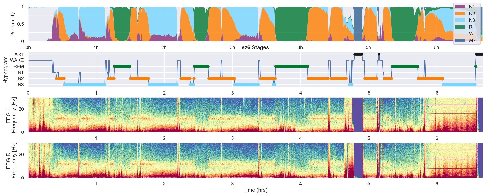
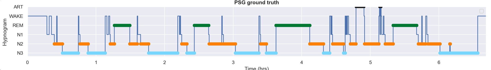

# ezscore-f

If you use the `ez6`, `ez6rt`, `ez6moe`, or related EzScore models, please cite:

> Coon WG, Zerr P, Milsap G, Sikder N, Smith M, Dresler M, Reid M. *ezscore-f: A Set of Freely Available, Validated Sleep Stage Classifiers for Forehead EEG.* bioRxiv, 2025. [doi:10.1101/2025.06.02.657451](https://doi.org/10.1101/2025.06.02.657451)

Copyright © 2025 The Johns Hopkins University Applied Physics Laboratory LLC.

This project is distributed under the terms of the [MIT License](https://github.com/coonwg1/ezscore/blob/main/LICENSE).

### Pretrained, artifact-aware sleep stage classifiers for forehead EEG

`ezscore-f` provides ready-to-use sleep staging models for two-channel forehead EEG. The models are designed for forehead EEG devices that provide symmetric left/right signals with referencing comparable to the ZMax headband. They support offline and real-time scoring and include an artifact class designed to isolate the signal contamination commonly encountered with wearable devices.

- 📦 Ready-to-use model checkpoints (`ez6`, `ez6rt`, and `ez6moe`)
- 📈 Offline and real-time scoring
- 🧪 Artifact-aware six-class output
- 🧠 Compatible with two-channel forehead EEG from a range of devices

<p align="center">
  
</p>

EzScore models were trained on ZMax data and validated on forehead EEG datasets described in the accompanying paper. Device-specific loaders are provided for convenience, but the models are not limited to those devices: compatible two-channel forehead EEG can be supplied through an MNE `Raw` object with `eegl` and `eegr` channels.

## What's new

### Updated visualization defaults — July 2026

Hypnograms and hypnodensities now use a magma-derived stage palette, while spectrograms use the `magma` colormap. The original EzScore colors remain available with `original_colors=True`.

### CGX PatchEEG compatibility — July 2026

**CGX PatchEEG is now compatible with EzScore.** The new `load_patcheeg()` loader supports:

- Raw CGX Patch binary files (`.cgx`)
- PatchEEG EDF files (`.edf`)
- Signed 24-bit CGX packet decoding at the native 500 Hz sampling rate
- Automatic conversion to the symmetric forehead montage expected by EzScore
- BCD recording-date and start-time extraction from raw CGX files
- Resampling to the model operating rate of 64 Hz

PatchEEG channels are automatically re-referenced to the symmetric left/right forehead montage expected by EzScore:

```text
eegl = -Ch1       = Fp1 - AFz
eegr = Ch2 - Ch1  = Fp2 - AFz
```

### Class-imbalance improvements — June 2025

The model training pipeline was updated with custom loss functions targeting class imbalance, improving performance in minority classes such as N1 sleep.

## Using forehead EEG data

EzScore expects symmetric left/right forehead EEG channels named `eegl` and `eegr`. Signals from any device can be used when they provide a comparable montage and are supplied in an MNE `Raw` object. The standard preprocessing pipeline resamples compatible input to the model operating rate of 64 Hz.

### Built-in data loaders

| Device or format | Loader | Input |
|---|---|---|
| ZMax | `load_zmax()` | Paired left/right EDF files |
| DCM | `load_dcm()` | Single two-channel EDF file |
| CGX PatchEEG | `load_patcheeg()` | Raw `.cgx` or two-channel `.edf` file |

These loaders return the same MNE `Raw` representation, allowing the downstream preprocessing, inference, and plotting workflow to remain device-independent.

### Other compatible forehead EEG devices

Data from another device does not require a dedicated loader when it can be expressed as symmetric left/right forehead channels. Create an MNE `Raw` object in volts with channel names `eegl` and `eegr`, then use the standard EzScore preprocessing and inference functions:

```python
import mne
import numpy as np

info = mne.create_info(
    ch_names=["eegl", "eegr"],
    sfreq=sample_rate,
    ch_types=["eeg", "eeg"],
)
raw = mne.io.RawArray(np.vstack([left_eeg, right_eeg]), info)
```

### Loading CGX PatchEEG data

Use the same function for raw CGX files and PatchEEG EDF exports:

```python
from ezscore.model_utils import load_patcheeg, preproc

raw = load_patcheeg("recording.cgx")  # or "recording.edf"
data_array, raw = preproc(raw, normalize=True)
```

`load_patcheeg()` interprets the first two EDF channels as PatchEEG Ch1 and Ch2, then re-references them before returning `eegl` and `eegr`. MNE stores the resulting EEG internally in volts, consistent with the other EzScore loaders.

## Installation

EzScore supports Python 3.9–3.11. This project uses the [`uv` package manager](https://docs.astral.sh/uv/getting-started/installation/), although an existing compatible Python environment may also be used.

### Install `uv`

On macOS or Linux:

```bash
curl -LsSf https://astral.sh/uv/install.sh | sh
```

If `curl` is unavailable:

```bash
wget -qO- https://astral.sh/uv/install.sh | sh
```

On Windows:

```powershell
powershell -ExecutionPolicy ByPass -c "irm https://astral.sh/uv/install.ps1 | iex"
```

### Install EzScore

```bash
git clone https://github.com/coonwg1/ezscore.git
cd ezscore

uv venv
uv pip install -e .
source .venv/bin/activate
```

On Windows, activate the environment with `.venv\Scripts\activate`.

## Scoring and plotting

Once a compatible recording has been loaded and a model is available, score and plot it with the standard utilities:

```python
from ezscore.model_utils import ezpredict, ezspectgm, plot_summary

hypnogram, hypnodensities = ezpredict(model=model, data=data_array)
spectrogram = ezspectgm(raw)

# New magma-based defaults
plot_summary(hypnogram, hypnodensities, spectrogram)

# Original stage colors and Spectral_r spectrograms
plot_summary(
    hypnogram,
    hypnodensities,
    spectrogram,
    original_colors=True,
)
```

The default hypnodensity stack is ordered `N3 → N2 → N1 → REM → Wake → Artifact` from bottom to top. Wake is transparent in the density plot and uses only the neutral hypnogram trace rather than an accent marker.

## Test the installation

Run the included ZMax demonstration:

```bash
python ezscore_demo.py
```

If the installation is working, the script opens a summary figure similar to this:

<p align="center">
  
</p>

The corresponding consensus-scored PSG reference is shown below:

<p align="center">
  
</p>

## Troubleshooting

### `uv` and TensorFlow installation issues

Some macOS users have reported TensorFlow dependency problems when using `uv sync`. If this occurs, create the environment using the commands shown above:

```bash
uv venv
uv pip install -e .
```

For download timeouts, increase the `uv` timeout and retry installation:

```bash
export UV_HTTP_TIMEOUT=999
```

If an issue persists, please [open a GitHub issue](https://github.com/coonwg1/ezscore/issues).

## Citation

If you use the `ez6`, `ez6rt`, `ez6moe`, or related EzScore models, please cite:

> Coon WG, Zerr P, Milsap G, Sikder N, Smith M, Dresler M, Reid M. *ezscore-f: A Set of Freely Available, Validated Sleep Stage Classifiers for Forehead EEG.* bioRxiv, 2025. [doi:10.1101/2025.06.02.657451](https://doi.org/10.1101/2025.06.02.657451)

## License and copyright

Copyright © 2025 The Johns Hopkins University Applied Physics Laboratory LLC.

This project is distributed under the terms of the [MIT License](https://github.com/coonwg1/ezscore/blob/main/LICENSE).
